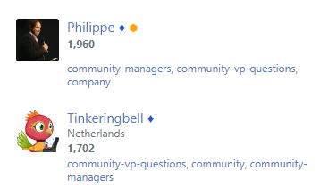

# Userscripts

These scripts are designed for Tampermonkey. They'll almost certainly work with other userscript managers, but if they don't, ¯\\_(ツ)\_/¯

---

* [Simple Badges](https://github.com/AMiller42/Userscripts/raw/main/simple-badges.user.js): If you don't like the new Mod and Staff badges that were added to Meta Stackexchange sites, this script replaces them with a diamond and a hexagon, respectively:   
 

* [Extra Links](https://github.com/AMiller42/Userscripts/raw/main/extra-links.user.js): Taken from [this meta.stackexchange post](https://meta.stackexchange.com/a/367982/1035814), this userscript adds links to "Meta" and "Chat" in the sidebar, and on Meta sites, the "Meta" link is changed to a "Main" link:  

